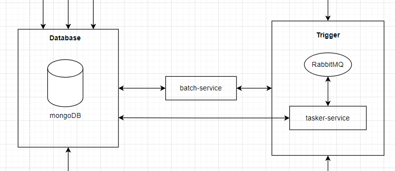

# BATCH-SERVICE
This document is the documentation of this service. It was the automation services to support 8excite project. 

### Architecture Diagram

Processors for the batch service will be triggered via RabbitMQ or scheduled by tasker-service with cron jobs.  It will be processed automatically when the specified date time hit.

### Processor Listing

1. applicationBroadcastProcessor
2. brithdayGiftProcessor
3. birthdayGiftreminderProcessor
4. bundleShipmentReminderProcessor
5. campaignGroupBuyProcessor
6. cancelOrderProcessor
7. cancelShipmentProcessor
8. createGroupBuyProcessor
9. createWarehouseBundleShipmentProcessor
10. createWarehouseOrderProcessor
11. groupBuyBotProcessor
12. groupBuyClosingSoonProcessor
13. groupBuyExpirationProcessor
14. groupBuyProcessor
15. newBrandNotificationProcessor
16. newBrandProductNotificationProcessor
17. newCategoryNotificationProcessor
18. orderRatingReminderProcessor
19. productImportProcessor
20. productKeywordProcessor
21. refundOrderOrShipmentProcessor
22. refundOrderProcessor
23. rewardProcessor
24. sendEmailNotificationProcessor
25. sendPushNotificationProcessor
26. takafulReminderProcessor

#### 1. applicationBroadcastProcessor
##### Flow Diagram

#### 23. rewardProcessor
##### Flow Diagram

#### 24. sendEmailNotificationProcessor
##### Flow Diagram

#### 25. sendPushNotificationProcessor
##### Flow Diagram

