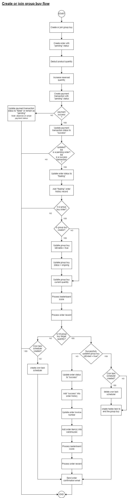

# EXCITE-SERVICE
This document is the documentation of this service. It was the backend services of the 8excite+ application.  Includes all user interactions while performing steps in the 8excite+ app.

## Architecture Diagram

---
## Modules
### 1. Product
#### Description
This module will trigger when user interact with product. It only including read feature. Will return single product detail or a list of products.

- **Product Type**:
	- **Simple product** - normal product 
	- **Variation product** - product having variations (variations field length > 0)
	- **Bundle product** - can bundled with simple product or variation product (products field length > 0 AND isBundle field = true)
	- **Free gift product** - product cannot be purchased (isFree field = true)
	
#### Flow Diagram
#### Detailed Flow Diagram
#### List of APIs
- GET /products
- GET /products/{productId} 

### 2. Group Buy
#### Description
#### Flow Diagram
#### Detailed Flow Diagram
#### List of APIs
- GET /groupBuys
- GET /groupBuys/{groupBuyId} 

### 3. Order
#### 3.1 Single Group Buy Calculator 
##### Description
This module will trigger when user checkout with group buy product. It will calculate user cart product with voucher and 8excite point. User can select the payment method they prefer. After calculated, user will get the total amount that need to pay. 

##### Flow Diagram

##### List of APIs
- POST /calculator/checkout/groupBuys/summary

#### 3.2 Single Group Buy Checkout
##### Description
This module will trigger when user checkout with group buy product after single group buy calculator. It will generate order based on the calculator result.

##### Flow Diagram

##### List of APIs
- POST /user/orders

#### 3.3 Multi Group Buy Calculator
##### Description
This module will trigger when user checkout with multiple group buy product. It allow user add their interesting group buy product into watchlist first, then checkout. Before checkout, it will calculate the final amount based on user input (voucher, 8excite point, etc).

##### Flow Diagram

##### List of APIs
- POST /v2/calculator/checkout/summary

#### 3.4 Multi Group Buy Checkout
#### 3.5 Group Buy Top Up Calculator
##### Description
This module will trigger when user checkout with pending topup group buy orders.

##### Flow Diagram

##### List of APIs
- POST /v2/calculator/checkout/groupBuys/{groupBuyId}/topup/summary 

#### 3.6 Group Buy Top Up Checkout

### 4. Warehouse
### 5. Bundle Shipment
### 6. Inventory

### 7. Reward

---
## Utils
### 1. Google Address
#### 1.1 Get City
##### Flow Chart

Get the address from google map api. For the city will having different object name, this function will be based on city's object name, to return the correct city name.

#### 1.2 Unwrap Address Component
##### Flow Chart

### 2. Redeem Point Calculator
#### 2.1 Calculate Summary
##### Flow Chart

### 3. Order
#### 3.1 Order Comparision Sort
##### Flow Chart

Order comparison will compare the order within
- product
- group buy
- shipping method
- logistic
- address, detail must be same
- is the product having same variation
- is the product having bundle, the bundle same, having same bundle item variation?